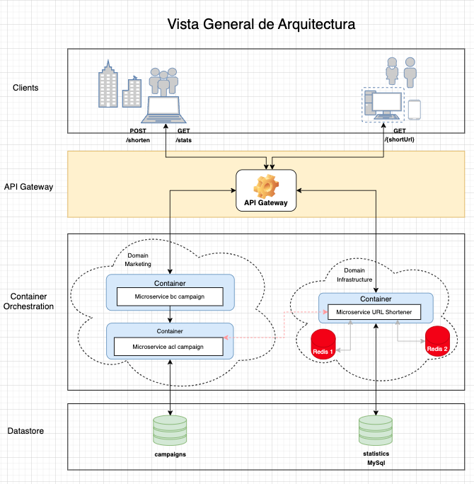
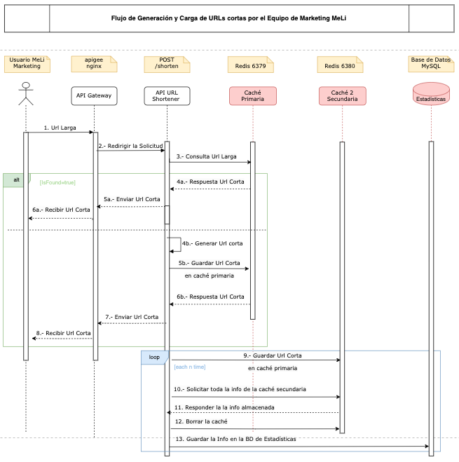
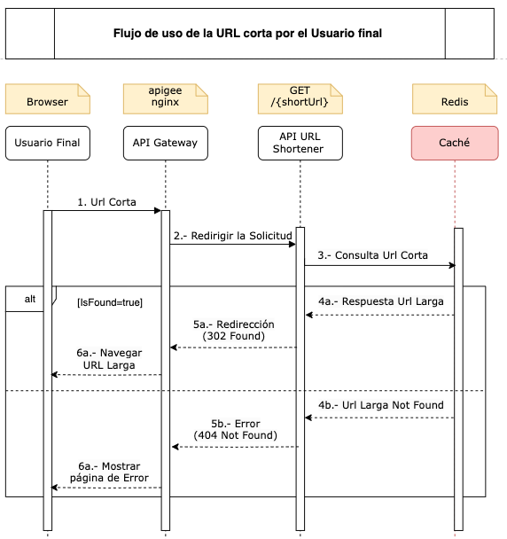
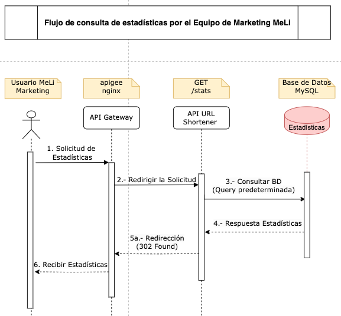

# Proyecto: MeLi's Challenge

## Descripción

Este proyecto tiene como objetivo proporcionar una solución para construir una API que permita acortar las URLs oficiales del Meli's Website con fines de mejorar los mensajes en las campañas de marketing, especialmente las dirijidas a  las redes sociales. 
Utiliza una arquitectura escalable y está diseñada para ser fácil de mantener y extender.

## Arquitectura General

A continuación se muestra un diagrama, que muestra una vista general de la arquitectura del proyecto:



## Flujos Principales

### Flujo 1: Generación de URL Corta y Carga en la Caché.

En este flujo, un usuario autorizado del equipo de Meli's Marketing, previa selección de las URLs que participarán en la campaña de marketing,
utiliza la API para generar la URL corta para cada URL larga que se requiera. Este flujo almacena automáticamente en la caché del servicio, de tal manera que pueda ser utilizado, en seguida.
El siguiente diagrama ilustra los pasos involucrados:



1. **Solicitud de acortar URL**: El usuario del team Meli's Marketing envía la solicitud a la API.
2. **Generación de URL Corta**: La API cheque en caché si ya existe la URL corta, si no existe, la genera y la almacena en caché.
3. **Registrar Estadística**: Se registra en la caché secundaria la estadística de la URL larga solicitada y además corta generada.
4. **Respuesta**: Se responde al usuario con la URL corta generada.

### Flujo 2: Uso de URL Corta por parte de los Usuarios Finales.

Este flujo describe a través de un diagrama de secuencia cómo un usuario final puede utilizar una URL corta generada por el equipo de Meli's Marketing:



1. **Solicitud de navegación de la URL**: El usuario final, desde su browser, solicita alcanzar el recurso de la MeLi's website representado por la URL corta.
2. **Búsqueda de la URL Corta**: La API busca la URL corta en la caché y se existe redirige al recurso de la MeLi's website (URL Larga).
3. **Registro de Estadística**: Se registra en la caché secundaria la estadística de la URL corta solicitada.
4. **Manejo de Errores**: Si la URL corta no existe, se responde con un mensaje de error. Opcionalmente se puede redirigir a una página de error.

### Flujo 3: Consulta de Estadísticas por parte del Equipo de Meli's Marketing.

Este flujo muestra se recuperan las estadísticas de uso de las URLs cortas generadas por el equipo de Meli's Marketin y usadas por los usuarios finales.



1. **Solicitud de Estadísticas**: El usuario del team Meli's Marketing envía la solicitud a la API.
2. **Consulta a la Base de Datos**: El servidor consulta la base de datos para obtener los datos estadísticos solicitados.
4. **Respuesta**: Los datos procesados se envían de vuelta al usuario y si no existen datos se responde con un mensaje vacío.


## Requerimientos

- Docker
- Docker Compose
- JDK 17 or higher
- Gradle 7.2 or higher
- 
## Instrucciones de Instalación

Para instalar y ejecutar este proyecto localmente, sigue los siguientes pasos:

### Construcción con Gradle y luego Docker Compose

1. **Clonar el repositorio**:
    ```bash
    git clone git@github.com:velizj/reto.git
    cd reto
    ```
2. **Construir el proyecto con Gradle**:
    ```bash
    ./gradlew clean build
    ```
3. **Construir la imagen de contenedor de la app**:
    ```bash
   docker build -t demo-app .
    ```

4. **Levantar los contenedores con Docker Compose**:
    ```bash
    docker-compose up --build -d
    ```